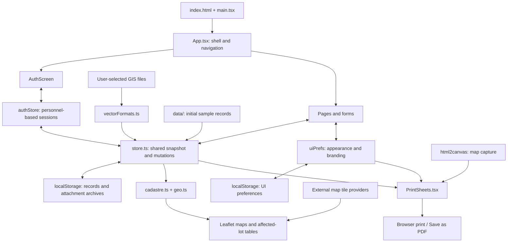

# CGPP-Road-Project-Inventory
Django PostGIS Road Inventory System

A browser-based road inventory and project monitoring application for the Office of the City Engineer, Puerto Princesa City, Palawan. RPIS combines project records, road mapping, cadastral overlays, and right-of-way (ROW) analysis in one interface.

## Project status

This repository contains a restored, working **local demonstration** built with React and TypeScript, including sample records. Data is saved in the current browser.

Despite the original repository name and some inherited interface labels, this version does **not** include a Django server, PostGIS database, GDAL service, or GeoServer deployment. Supabase is listed as a dependency but is not connected to the current application. Service status panels and activity messages include demonstration content.

## Features

- **Geospatial overview:** interactive road and project maps, dashboard totals, and status summaries.
- **Project ledger:** project encoding and editing, implementors, personnel assignments, schedules, completion percentages, and financial tracking.
- **Road inventory and registry:** road segments, pavement information, street references, and barangay coverage.
- **Lot & ROW analysis:** cadastral polygons, centerline imports, adjustable corridor buffers, affected areas, ownership categories, and lot titles.
- **Centerline linking:** assign an axis to a project from the Centerlines tab and open the linked project detail. The selector prevents assigning a project already linked to another axis.
- **Supporting records:** technical specifications, revisions, as-built details, variation orders, suspension orders, and document attachments.
- **Reports:** printable project ledger, road inventory, and project detail sheets, plus CSV export where available.
- **Appearance:** seven themes, including Futuristic, selectable fonts, and interface scaling.
- **Company branding:** upload a logo and edit the company title and tagline. Branding appears on the header and login screen; the uploaded logo also appears on printouts.
- **Demo access management:** roles, permissions, personnel accounts, signup verification, and administrator-managed password reset requests.

## Technology

| Area | Implementation |
| --- | --- |
| Interface | React 18, TypeScript |
| Development and build | Vite 6 |
| Styling | Tailwind CSS 4, custom CSS |
| Mapping | Leaflet, React Leaflet |
| Charts | Recharts |
| Interaction | Framer Motion, dnd-kit |
| Persistence | Browser localStorage |
| Printing and capture | Browser printing, html2canvas |
| Spatial calculations | Local TypeScript geometry functions |

## Run locally

Use a recent Node.js installation and pnpm. The commands below use the committed `pnpm-lock.yaml` to reproduce the restored dependency set.

From the repository root:

```sh
pnpm install --frozen-lockfile --ignore-scripts
pnpm dev --configLoader native --host 127.0.0.1
```

Open **http://localhost:3000**.

The native configuration loader avoids a configuration-bundling access issue encountered in the Windows restoration environment. Port 3000 must be available. The explicit host option keeps this local demo bound to the current computer.

### Build and preview

```sh
pnpm typecheck
pnpm build --configLoader native
pnpm exec vite preview --configLoader native --host 127.0.0.1 --port 3000 --strictPort
```

The build is written to `dist/`. Preview serves that build; rebuild and refresh the browser after source changes. During development, use the development server for automatic updates.

The original `package-lock.json` is retained from the backup. It is separate from the restored pnpm lockfile; avoid mixing package managers in the same installation.

### Windows shortcut

For an already installed and built copy, double-click `Start-Demo.cmd`. It invokes `Start-Demo.ps1`, starts a hidden local preview server when port 3000 is free, and opens the browser. It needs Node.js and the installed dependencies; it does not install packages or rebuild the app.

## Demo sign-in

| Role | Email | Password |
| --- | --- | --- |
| Program Admin | `admin@oce.puertoprincesa.gov.ph` | `admin123` |
| Executive | `city.engineer@oce.puertoprincesa.gov.ph` | `oce2026` |
| Encoder | `jose.alcala@oce.puertoprincesa.gov.ph` | `demo123` |

The sign-in screen also offers a read-only guest session. These are built-in demonstration credentials, not production accounts. Authentication and permissions run in the browser and are not a server-enforced security boundary.

## Import cadastral lots

In **Lot & ROW Analysis → Cadastre**, choose **Load shapefile** and select the matching `.shp` and `.dbf` files. GeoJSON is also supported.

### Attribute fields

| Field | Recommended type | Purpose | Example |
| --- | --- | --- | --- |
| `OWNER` | Text | Source for Private/Government classification | `Juan Dela Cruz` |
| `AREA` | Numeric | Total lot area in square metres | `1250.50` |
| `LOT_TITLE` | Text | Lot title reference or title number | `TCT-001234` |

Use the uppercase names above. The importer also accepts lowercase equivalents, `NAME`/`name` as an owner fallback, and `TITLE`/`title` as a lot-title fallback. Define title references as text to preserve leading zeroes. Numeric areas should not contain commas, currency symbols, or unit labels.

- Missing owner names receive a generated placeholder.
- Missing or nonpositive area is calculated from the polygon. Stored areas are rounded to whole square metres.
- Missing lot titles display as `—`.
- Zonal values and ROW acquisition-cost calculations are no longer used. Project contract and expenditure fields remain available separately.

### Geometry requirements and limitations

- Export actual coordinates in **WGS 84 / EPSG:4326**. The importer does not read `.prj` files or reproject coordinates.
- The shapefile parser supports Polygon and PolygonZ records; elevation is not used.
- For this demo, use **one single-part polygon without holes per DBF record**, with no deleted DBF records. Multipart shapes, holes, and skipped records can cause incorrect geometry-to-attribute matching.
- The DBF reader uses Latin-1 decoding and does not read `.cpg` encoding metadata.
- Lot IDs are generated as `LOT-UP-001`, etc.; existing lot-number fields are not mapped.
- Barangay is estimated from the nearest registered barangay centre, not by boundary intersection or an imported barangay field.
- Importing a cadastre **replaces the current parcel collection** rather than appending lots.

### Ownership detection

Ownership displays only **Private** or **Government**. Classification uses a case-insensitive search of the source owner name for any of:

```text
city, government, denr, dpwh, national, public
```

Any match is classified as Government; otherwise the lot is Private. This is a simple text heuristic, not verified legal ownership. Review the source names before relying on the classification.

## Import and link centerlines

1. Open **Lot & ROW Analysis → Centerlines**.
2. Choose **Import KML / GPX / SHP**.
3. Use KML, GPX, or GeoJSON line features for axes. SHP + DBF imports load cadastral lots, not centerlines.
4. Select a **Linked project record** on the imported axis. Changes save automatically.
5. Adjust the buffer radius and review the **Affected** tab or the project's ROW panel.

Use **No linked project** to remove an association. The project detail currently uses one linked axis. Spatial overlap results are local geometric estimates intended for demonstration and review, not authoritative survey measurements.

## Customize appearance and branding

Open the account menu → **Preferences → Look & Feel**.

- Select a theme, heading font, body font, and interface size.
- Under **Company branding**, upload a PNG, JPEG, or WebP logo up to **500 KB**.
- Enter the company title and tagline, then select **Save branding**.
- Remove the uploaded logo to restore the default emblem.

Settings persist in the same browser. The logo appears on the header, login page, and printable sheets. Printed sheets retain their drafting layout; company title/tagline customization currently applies to the app header and login page, while other institutional text in reports and module headers remains fixed.

## Data storage and recovery

The application saves records, imported geometry, and accounts in `localStorage`. Attachment archives use separate storage keys. Appearance and branding are saved separately from the project data.

- Different browsers, profiles, computers, or origins have separate data.
- Clearing browser/site data can remove locally entered records, attachments, and branding.
- Browser storage quotas limit how much data and how many attachments can be retained.
- The source-code repository does not back up records entered in the browser.
- Map tiles and hosted fonts require an internet connection. There is no complete offline map cache.
- This version has no shared database, automatic cloud backup, or multi-user synchronization.

Retain original import files and documents. Do not treat this demo as the only copy of operational records.

## Source layout

```text
src/
  App.tsx                   Application shell and page navigation
  components/               Forms, maps, project drawer, branding, access controls
  data/                     Models, sample data, catalogs, ROW calculations
  lib/                      Geometry, vector-file parsing, EXIF utilities
  pages/                    Overview, Projects, Inventory, Lot Analysis, and more
  print/PrintSheets.tsx      Shared print templates and print session handling
  state/store.ts            Application state and browser persistence
  state/authStore.ts        Demo account and session logic
  state/uiPrefs.ts          Appearance and branding preferences
  index.css                 Themes and print styles
```

## Validation

TypeScript checking and production builds have passed during restoration and updates. Selected workflows have been checked in the browser, including administrator login, centerline linking, appearance settings, branding title updates, and project-form focus retention. A comprehensive automated test suite is not yet included.

## Before production use

A production version needs server-side authentication and authorization, a persistent shared database, backups, validated GIS imports with coordinate transformation, and robust handling of multipart geometry and polygon holes. Replace demonstration service indicators and sample activity messages with actual application status.

## License

No license is declared in this README. Add a `LICENSE` file with the repository owner's chosen terms before representing the project as licensed for redistribution or reuse.

## Detailed file structure

```text
.
├── index.html                   Browser entry point; app and print mount points
├── package.json                 Dependencies and development/build scripts
├── pnpm-lock.yaml               Restored dependency lockfile
├── package-lock.json            Original backup's npm lockfile
├── tsconfig.json                TypeScript configuration
├── vite.config.js               React/Tailwind integration and server settings
├── README.md                    Setup, usage, architecture, and limitations
├── RECOVERY-NOTES.md             Restoration notes
├── Start-Demo.cmd                Windows launcher entry point
├── Start-Demo.ps1                Starts the built local preview
├── dist/                        Generated production build
└── src/
    ├── main.tsx                 Mounts React and loads styles
    ├── App.tsx                  Navigation, page shell, error boundary
    ├── index.css                Theme tokens, application and print styling
    ├── pages/
    │   ├── AuthScreen.tsx       Sign-in, signup, and reset requests
    │   ├── Overview.tsx         Geospatial dashboard
    │   ├── Projects.tsx         Ledger, implementors, personnel, catalogs
    │   ├── Inventory.tsx        Road inventory
    │   ├── LotAnalysis.tsx      Cadastre, centerlines, affected lots
    │   ├── Roads.tsx            Road registry
    │   ├── Barangays.tsx        Barangay module
    │   ├── Analytics.tsx        Analytical summaries
    │   └── System.tsx           Demonstration GIS stack information
    ├── components/
    │   ├── Sidebar.tsx          Module navigation
    │   ├── TopBar.tsx           Branding, account menu, preferences
    │   ├── MapView.tsx          Main interactive map
    │   ├── ProjectDrawer.tsx    Project detail panel
    │   ├── projectForms.tsx     Project encoder and shared modal
    │   ├── profileForms.tsx     Personnel and contractor forms
    │   ├── specForms.tsx        Specifications and order forms
    │   ├── recordDetails.tsx    Technical, revision, and as-built sections
    │   ├── DocumentIntake.tsx   Attachment ingestion
    │   ├── ROWImpact.tsx        Project-level ROW map and affected lots
    │   ├── BufferControl.tsx    Corridor radius input
    │   ├── CenterlineBufferModal.tsx  Buffer editor and impact summary
    │   ├── BarangayRegistry.tsx Barangay management
    │   ├── CatalogManager.tsx   Reference catalog management
    │   ├── CatalogSelect.tsx    Catalog-backed dropdowns
    │   ├── SearchSelect.tsx     Searchable selection controls
    │   ├── AccessControl.tsx    Roles, users, and Look & Feel
    │   ├── BrandingSettings.tsx Logo/title/tagline editor
    │   ├── CompanyLogo.tsx      Shared uploaded-logo rendering
    │   ├── charts.tsx           Chart components
    │   ├── icons.tsx            Icons and default seal
    │   ├── ui.tsx               Shared visual components
    │   ├── toast.tsx            Notifications
    │   └── confirm.tsx          Confirmation dialogs
    ├── state/
    │   ├── store.ts             Unified data, mutations, persistence
    │   ├── authStore.ts         Authentication over personnel records
    │   └── uiPrefs.ts           Theme, fonts, sizing, and branding
    ├── data/
    │   ├── registry.ts          Projects, contractors, personnel, sample data
    │   ├── roads.ts             Road geometry and treatment definitions
    │   ├── roadsRegistry.ts     Road registry model and seeds
    │   ├── barangays.ts         Barangay models and reference points
    │   ├── cadastre.ts          Parcels, centerlines, sample lots, ROW engine
    │   ├── catalogs.ts          Technical/reference catalogs
    │   ├── specs.ts             Specification and order definitions
    │   └── auth.ts              Roles, capabilities, password utilities
    ├── lib/
    │   ├── vectorFormats.ts     KML, GPX, GeoJSON, SHP, DBF parsing
    │   ├── geo.ts               Geometry and spatial calculations
    │   └── exif.ts              Image geotag extraction
    └── print/
        └── PrintSheets.tsx      Ledger, inventory, project print templates
```

`node_modules/`, build output, and local server logs are generated artifacts rather than source code. The file tree describes the restored working copy; a clean Git checkout may omit generated directories.

## Application architecture

RPIS is currently a **client-side single-page application**. React renders the screens, TypeScript modules handle the data and geometry, and browser storage retains local changes. There is no application API server between the interface and its data.



### State and persistence

`store.ts` maintains a shared snapshot exposed to React through `useSyncExternalStore`. Mutation functions update that snapshot, persist it, and notify subscribed components. Project forms can keep a local draft until saved; controls such as centerline links save directly through store mutations.

The snapshot includes projects, contractors, personnel, parcels, centerlines, barangays, road registry entries, catalogs, roles, reset requests, and the current session. The main storage key is `rpis-store-v30`. Raw attachment content is stored separately under `rpis-raw:` keys and reattached when the snapshot is loaded.

`uiPrefs.ts` maintains a separate preference store under `rpis-uiprefs-v1`. It applies the theme and font settings to the document and supplies branding to the header, login screen, and print templates. Uploaded logos are stored as image data URLs.

At startup, the application loads valid saved data or initializes sample data. The legacy zonal-value field is discarded when saved parcels are rehydrated; missing lot titles become empty strings. This does not convert historical numeric values into title references.

### Data relationships

| Entity | Relationship |
| --- | --- |
| Project | References a contractor through `implementorId` and a personnel record through `inchargeId` |
| Project | Optionally references a road through `roadId` |
| Project | Contains attachments, specification details, variations, and suspensions |
| Centerline | Optionally references a project through `projectId` |
| Centerline | Contains its coordinate sequence and buffer radius |
| Parcel | Contains polygon geometry, source owner, ownership category, barangay, area, and lot title |
| Personnel | Also serves as the account record and references a role |
| Role | Defines capabilities used by interface controls |

These are JavaScript object references by ID, not database foreign-key constraints. The centerline selector enforces the current single-axis assignment workflow in the interface; the underlying data shape itself is not a relational uniqueness constraint.

### GIS import and ROW flow

1. The user selects local files through the Cadastre or Centerlines controls.
2. `vectorFormats.ts` parses supported formats in the browser.
3. `LotAnalysis.tsx` maps attributes, derives ownership and barangay, and stores parcels or centerlines.
4. `runROWAnalysis()` builds a corridor and calculates the intersection area for each parcel using local geometry helpers.
5. The resulting rows contain lot ID, lot title, ownership, affected area, and percentage affected. Government and private affected areas are totaled separately.
6. The same analysis supports the Lot & ROW page, project detail panel, buffer modal, and printed project report.

References to spatial SQL in the interface illustrate the intended GIS concepts. No PostGIS SQL is executed by this implementation.

### Printing flow

Print components render into `#print-root` using a React portal. Print styles hide the interactive application and apply the report layout. Ledger and inventory use landscape A4; project detail uses portrait A4. Map captures are included where supported, and image decoding is awaited before opening the browser print dialog. The shared sheet header uses the uploaded company logo or the default OCE emblem.

### Runtime boundaries

The local Vite server serves application files. It does not provide authentication, database storage, or GIS processing services. External map tiles and hosted fonts are network resources; application records remain in the browser in this version. A future backend architecture is a separate development step and is not implemented by the diagrams above.
